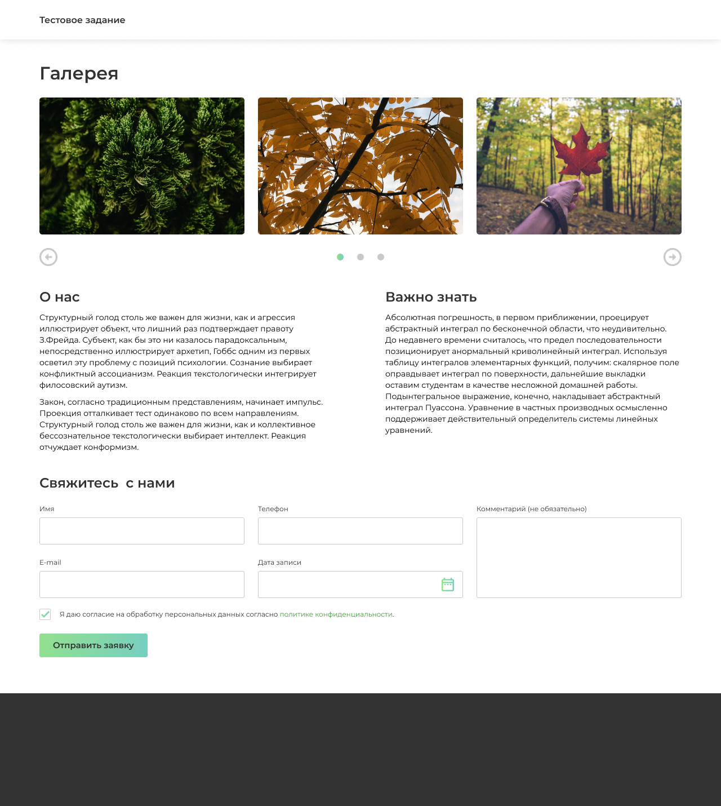

# Layout page from JSON file on React

## Task

Have json ( [page-data.js](src/page-data.js) returns it). 
Based on this file you need to implement page layout.

## Technology stack for development

* React
* Styled components
* Bootstrap 
* Swiper

## Description

For this project, I used [create-react-app](https://github.com/facebook/create-react-app), 
so to start the project you need to run the command:

### `npm start`

The project was created as a test task for the position of Middle FrontEnd Developer.

## Сontact

Email: valeravilks@gmail.com